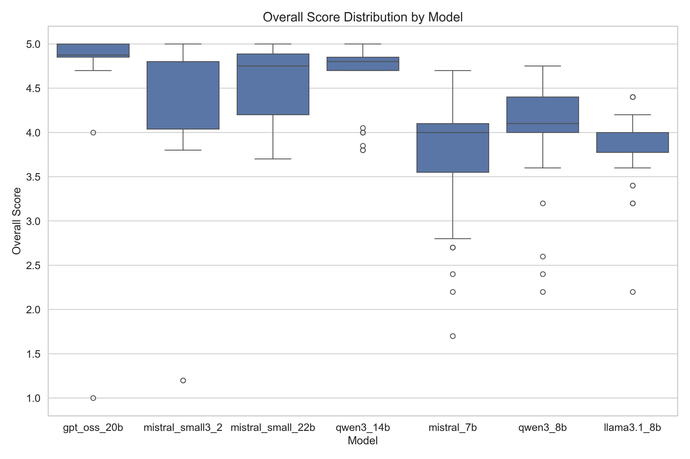
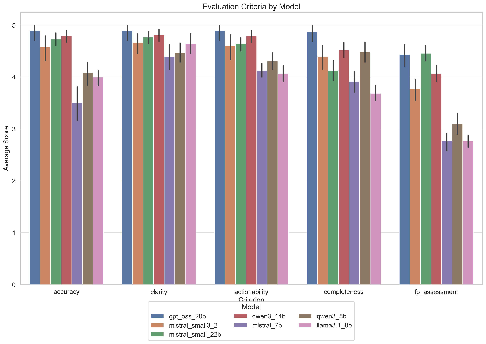
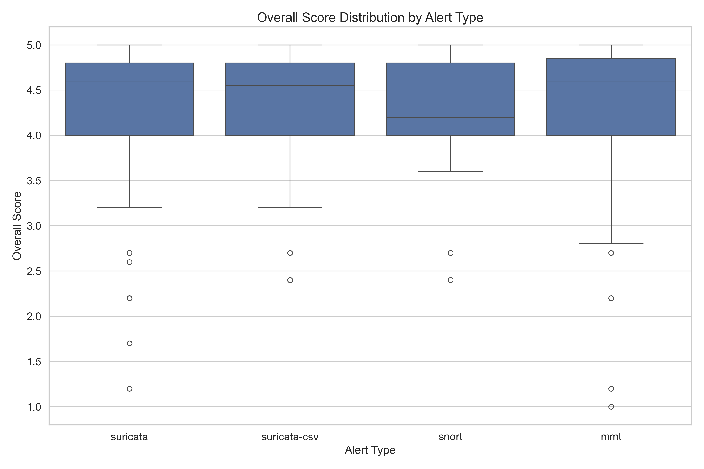
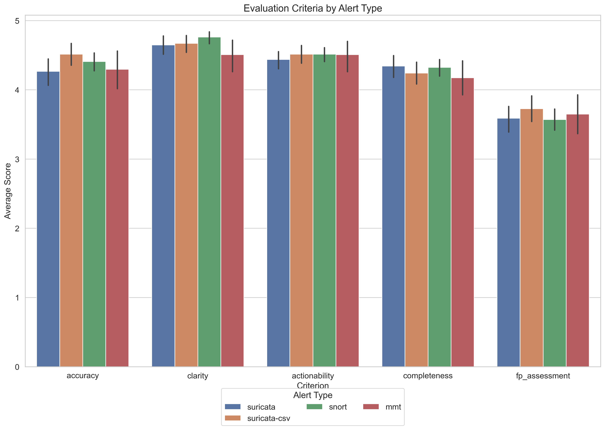
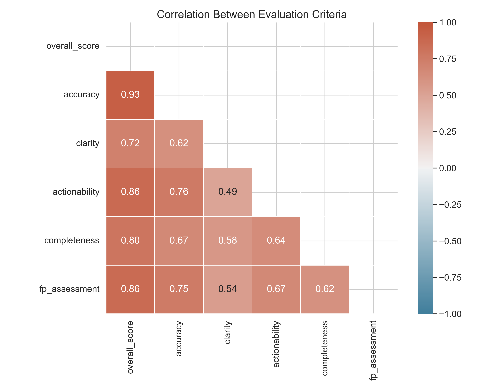

# Security Alert Analysis Report

## Summary Statistics

- Total alerts analyzed: 337
- Models analyzed: gpt_oss_20b, mistral_small3_2, mistral_small_22b, qwen3_14b, mistral_7b, qwen3_8b, llama3.1_8b
- Alert types analyzed: suricata, suricata-csv, snort, mmt

## Executive Summary

- **Best performing model**: gpt_oss_20b (Average score: 4.81)
- **Worst performing model**: mistral_7b (Average score: 3.72)
- **Best handled alert type**: suricata-csv (Average score: 4.36)
- **Worst handled alert type**: suricata (Average score: 4.26)

### Key Findings

- All models score highest on **clarity** (4.66/5)
- All models score lowest on **fp_assessment** (3.62/5)
- Best combination: **gpt_oss_20b** analyzing **suricata** alerts (4.90/5)
- Worst combination: **mistral_7b** analyzing **mmt** alerts (3.52/5)

## Visualizations

### Model Overall Score Distribution

*Figure 1: Box plot showing the distribution of overall scores for each model.*

**Key Points:**

- **gpt_oss_20b** has the highest median overall score (4.81).
- **mistral_7b** has the lowest median overall score (3.72).
- **qwen3_14b** shows the most consistent performance (lowest variability).
- **mistral_small3_2** shows the most variable performance (highest variability).

### Model Performance by Criteria

*Figure 2: Comparison of model performance across different evaluation criteria.*

**Key Points:**

- **gpt_oss_20b** performs best in **accuracy**.
- **gpt_oss_20b** performs best in **clarity**.
- **gpt_oss_20b** performs best in **actionability**.
- **gpt_oss_20b** performs best in **completeness**.
- **mistral_small_22b** performs best in **fp_assessment**.
- All models score highest on **clarity** and lowest on **fp_assessment**.
- The gap between models is largest for **completeness** criterion.

### Alert Type Overall Score Distribution

*Figure 3: Box plot showing the distribution of overall scores for each alert type.*

**Key Points:**

- **suricata-csv** alerts have the highest median overall score (4.36).
- **suricata** alerts have the lowest median overall score (4.26).
- **snort** alerts show the most consistent evaluation scores.
- **mmt** alerts show the most variable evaluation scores.

### Alert Type Performance by Criteria

*Figure 4: Comparison of alert type performance across different evaluation criteria.*

**Key Points:**

- **suricata-csv** alerts score highest on **accuracy**.
- **snort** alerts score highest on **clarity**.
- **suricata-csv** alerts score highest on **actionability**.
- **suricata** alerts score highest on **completeness**.
- **suricata-csv** alerts score highest on **fp_assessment**.
- All alert types score highest on **clarity** metrics.
- All alert types score lowest on **fp_assessment** (false positive assessment).

### Model Performance by Alert Type

*Figure 5: Comparison of model performance across different alert types.*

**Key Points:**

- **gpt_oss_20b** performs best with **suricata** alerts (4.90/5).
- **mistral_7b** performs worst with **mmt** alerts (3.52/5).
- The biggest performance gap between models is for **suricata** alerts.
- Models are most consistent when evaluating **snort** alerts.

### Correlation Between Evaluation Criteria

*Figure 6: Heatmap showing the correlation between different evaluation criteria.*

**Key Points:**

- **overall_score** and **accuracy** have the strongest positive correlation (0.93).
- **accuracy** has the strongest correlation with overall score (0.93).
- **fp_assessment** has the weakest correlation with other criteria.

## Model Comparison

| Model | Count | Overall Score | Accuracy | Clarity | Actionability | Completeness | FP Assessment |
| ----- | ----- | ------------ | -------- | ------- | ------------- | ------------ | ------------- |
| gpt_oss_20b | 48 | 4.81 | 4.90 | 4.90 | 4.90 | 4.88 | 4.44 |
| mistral_small3_2 | 48 | 4.45 | 4.58 | 4.67 | 4.60 | 4.40 | 3.77 |
| mistral_small_22b | 48 | 4.58 | 4.73 | 4.77 | 4.65 | 4.12 | 4.46 |
| qwen3_14b | 48 | 4.64 | 4.79 | 4.81 | 4.79 | 4.52 | 4.06 |
| mistral_7b | 48 | 3.72 | 3.50 | 4.40 | 4.12 | 3.92 | 2.77 |
| qwen3_8b | 49 | 4.08 | 4.08 | 4.47 | 4.31 | 4.49 | 3.10 |
| llama3.1_8b | 48 | 3.85 | 4.00 | 4.65 | 4.06 | 3.69 | 2.77 |

## Alert Type Comparison

| Alert Type | Count | Overall Score | Accuracy | Clarity | Actionability | Completeness | FP Assessment |
| ---------- | ----- | ------------ | -------- | ------- | ------------- | ------------ | ------------- |
| suricata | 105 | 4.26 | 4.27 | 4.65 | 4.44 | 4.34 | 3.59 |
| suricata-csv | 70 | 4.36 | 4.51 | 4.67 | 4.51 | 4.24 | 3.73 |
| snort | 105 | 4.34 | 4.41 | 4.76 | 4.51 | 4.32 | 3.57 |
| mmt | 57 | 4.26 | 4.30 | 4.51 | 4.51 | 4.18 | 3.65 |

## Detailed Model Performance by Alert Type

### gpt_oss_20b

| Alert Type | Count | Average Score |
| ---------- | ----- | ------------- |
| mmt | 8 | 4.46 |
| snort | 15 | 4.89 |
| suricata | 15 | 4.90 |
| suricata-csv | 10 | 4.85 |

### mistral_small3_2

| Alert Type | Count | Average Score |
| ---------- | ----- | ------------- |
| mmt | 8 | 4.38 |
| snort | 15 | 4.49 |
| suricata | 15 | 4.35 |
| suricata-csv | 10 | 4.59 |

### mistral_small_22b

| Alert Type | Count | Average Score |
| ---------- | ----- | ------------- |
| mmt | 8 | 4.64 |
| snort | 15 | 4.43 |
| suricata | 15 | 4.71 |
| suricata-csv | 10 | 4.54 |

### qwen3_14b

| Alert Type | Count | Average Score |
| ---------- | ----- | ------------- |
| mmt | 8 | 4.68 |
| snort | 15 | 4.55 |
| suricata | 15 | 4.73 |
| suricata-csv | 10 | 4.63 |

### mistral_7b

| Alert Type | Count | Average Score |
| ---------- | ----- | ------------- |
| mmt | 8 | 3.52 |
| snort | 15 | 3.91 |
| suricata | 15 | 3.61 |
| suricata-csv | 10 | 3.77 |

### qwen3_8b

| Alert Type | Count | Average Score |
| ---------- | ----- | ------------- |
| mmt | 9 | 4.32 |
| snort | 15 | 4.09 |
| suricata | 15 | 3.85 |
| suricata-csv | 10 | 4.20 |

### llama3.1_8b

| Alert Type | Count | Average Score |
| ---------- | ----- | ------------- |
| mmt | 8 | 3.80 |
| snort | 15 | 4.01 |
| suricata | 15 | 3.65 |
| suricata-csv | 10 | 3.95 |

## Top and Bottom Performing Alerts

### Top 5 Alerts

| Model | Alert Type | Alert Signature | Overall Score |
| ----- | ---------- | --------------- | ------------- |
| gpt_oss_20b | suricata-csv | ET WEB_SERVER WebShell Generic - wget http - POST ... | 5.00 |
| mistral_small_22b | snort | ET POLICY Vulnerable Java Version 1.6.x Detected... | 5.00 |
| gpt_oss_20b | mmt | Trojan detection... | 5.00 |
| mistral_small_22b | mmt | Detection of WannaCry Ransomware... | 5.00 |
| gpt_oss_20b | suricata | ET WORM TheMoon.linksys.router 1... | 5.00 |

### Bottom 5 Alerts

| Model | Alert Type | Alert Signature | Overall Score |
| ----- | ---------- | --------------- | ------------- |
| gpt_oss_20b | mmt | 4 consecutive ICMP redirect packets. Possibly ICMP... | 1.00 |
| mistral_small3_2 | suricata | ET TOR Known Tor Exit Node Traffic group 50... | 1.20 |
| mistral_small3_2 | mmt | 4 consecutive ICMP redirect packets. Possibly ICMP... | 1.20 |
| mistral_7b | suricata | ET POLICY PE EXE or DLL Windows file download HTTP... | 1.70 |
| qwen3_8b | suricata | ET TROJAN Generic - POST To .php w/Extended ASCII ... | 2.20 |

## Conclusion

This analysis provides a comprehensive comparison of different models' performance in evaluating security alerts. Overall, **gpt_oss_20b** demonstrates the strongest performance across most metrics, particularly when analyzing **suricata** alerts. All models show strengths in **clarity** but could benefit from improvements in **fp_assessment** assessment.

The significant variation in performance across different alert types suggests that model selection should be tailored to the specific types of security alerts being analyzed. Further research could explore model ensembles or specialized training to address the specific challenges presented by **suricata** alerts.

